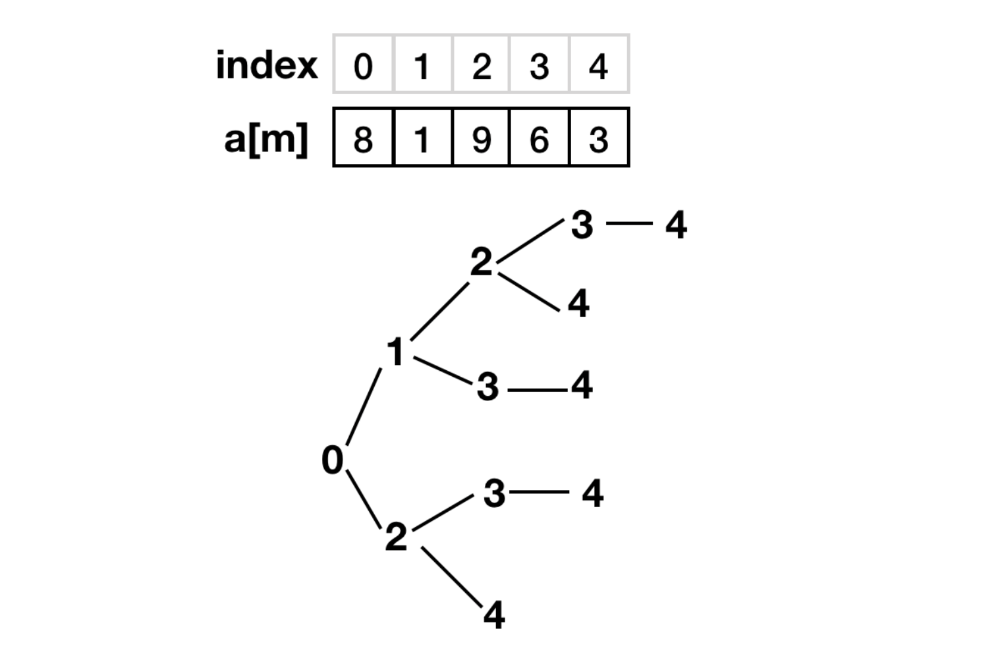

# 1、数字三角形

# 2、最大子序列和

# 3、最大子序列乘积

# 3、青蛙吃虫子

+ 题目：

有一只青蛙，每次可以跳1、2、3、...k个台阶。现在有一个台阶的序列a[m]，共有m个台阶。每个台阶上有a[i]个虫子。青蛙体力有限，最多能跳n次。问：青蛙最多能吃到多少只虫子？

+ 代码链接: [frog_eat_bug](https://github.com/Jarlonyan/interview_code/blob/master/dynamic_programming/frog_eat_bug.cpp)

+ 图例说明

每次最多跳3个台阶，最多跳3次

# 4, 找硬币问题

