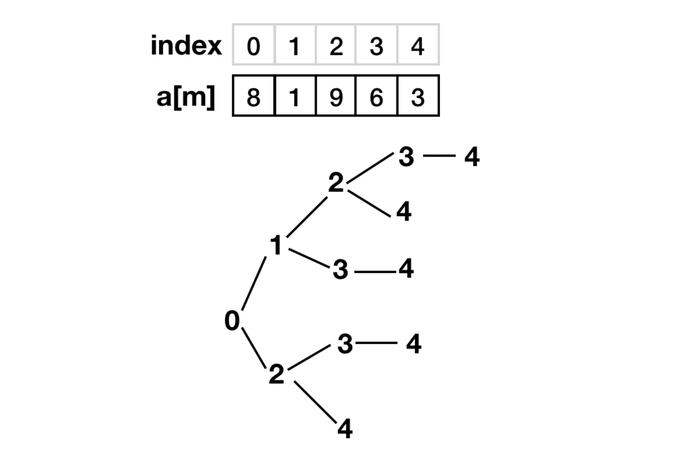

tencent 面试题:

有一只青蛙，每次可以跳1、2、3、...k个台阶。

现在有一个台阶的序列a[m]，共有m个台阶

每个台阶上有a[i]个虫子

青蛙体力有限，最多能跳n次

问：青蛙最多能吃到多少只虫子？

+ 图例说明

每次最多跳3个台阶，最多跳3次



+ 解法：

用深度优先搜索算法

+ 调用说明


```c++
    int dfs_solve(vector<int>& a, int depth, vector<int>& que,  int v, int& res);
    dfs_solve(a, 0, que, -1, res);
```

`a`: 数组a[m]=[1,8,2,9,6]，数组是从0开始，青蛙刚开始在台阶外，所以青蛙初始位置是-1

`depth`: 深度，刚开始是0

`que`: 存储路径

`v`: 目前的节点

`res`: 保存计算结果


